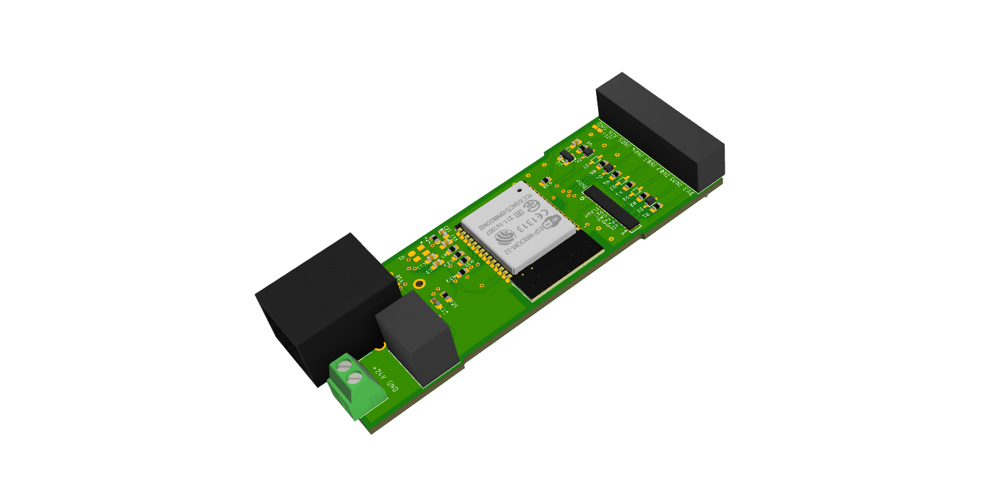
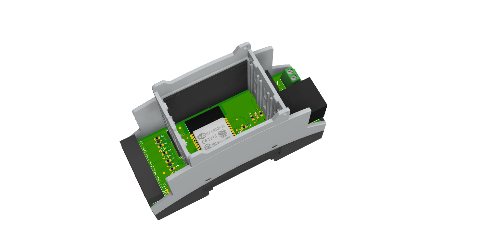

# SmartHome_SmartMeter
Smart Meter ist ein Modul (ESP32 + ETH) mit 6 Eingängen, die beliebig, über ein Script, konfiguriert werden können.

# Tasmota Einrichtung

Hier findest du die Dokumentation: [settings](/document/Tasmota_Einrichtung.md)

Hier findest du vorkompilierte firmware: [precompiled](/firmware_precompiled)

