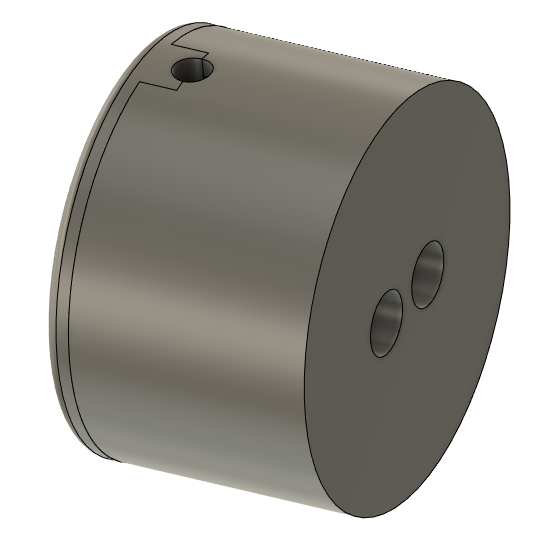

# SmartHome_SmartMeter
Smart Meter ist ein Modul (ESP32 + ETH) mit 6 Eingängen, die beliebig, über ein Script, konfiguriert werden können.

# Tasmota Einrichtung

Hier findest du die Dokumentation: [settings](/document/Tasmota_Einrichtung.md)

Hier findest du vorkompilierte firmware: [precompiled](/firmware_precompiled)

# Gehäuse

Gehäuseunterteil - BC 35,6 https://www.phoenixcontact.com/de-ch/produkte/einbaugehaeuseunterteil-bc-356-ut-hbus-bk-2896254
Gehäuseoberteil - BC 35,6 https://www.phoenixcontact.com/de-ch/produkte/einbaugehaeuseoberteil-bc-356-ot-u11-kmgy-2896034

# Bauteile
ETH Stecker HR911105A
https://lcsc.com/product-detail/Ethernet-Connectors-Modular-Connectors-RJ45-RJ11_HANRUN-Zhongshan-HanRun-Elec-HR911105A_C12074.html

PHY LAN8720A    https://www.microchip.com/en-us/product/LAN8720A
https://lcsc.com/product-detail/Ethernet-ICs_Microchip-Tech-LAN8720A-CP-TR_C45223.html 

# Pinout

## Pinout of ESP 8266 and WEMOS-D1

| Label | IO    | Beschreibung      | 
|-------|-------|-------------------|----------
| IN01  | IO01  | GPIO/TXD0         | 
| IN02  | IO03  | GPIO/RXD0         | 
| IN03  | IO05  | GPIO              | 
| IN04  | IO033 | GPIO/ADC_CH5      | used as Counter
| IN05  | IO016 | GPIO/RXD_2        | used for SML (See Script)
| AIN   | IO034 | GPIO/ADC_CH6      | 

